# Arquitectura de la Intranet Corporativa (MC - Intranet)

El siguiente diagrama ilustra la arquitectura de información, navegación y los puntos de contacto (formularios y documentos) de la intranet multicompañía.

Este modelo jerárquico sirve para comprender cómo fluye la interacción del usuario dependiendo de la gestión que requiere realizar o la compañía a la que pertenece (Projection Anstra, Essenza Foods, Budefry).

```mermaid
graph TD
    %% Nodo Principal
    INICIO["🏠 Inicio (MC - Intranet)<br>Portal Transversal multicompañía"]

    %% Categorías Globales (Transversales)
    INICIO --> ADM{"Administración"}
    INICIO --> TIC{"TIC"}
    INICIO --> GES{"Gestiones"}

    %% Formularios Transversales
    ADM --> A1([Solicitud Tiquetes Aéreos y Terrestres<br>Google Forms])
    ADM --> A2([Solicitud Viáticos<br>Google Forms])
    ADM --> A3([Solicitud Reserva de Hospedaje<br>Google Forms])

    TIC --> T1([Soporte TIC<br>Google Forms])
    TIC --> T2([Gestión de Usuarios TIC<br>Google Forms])
    TIC --> T3([Compras TIC<br>Google Forms])

    GES --> G1([Sol. Servicio Logístico No Venta<br>Google Forms])
    GES --> G2([Registro Certificados de Votación<br>Google Forms])

    %% Sitios por Compañía (Subpáginas)
    INICIO -->|Subpágina| PA["🏢 Projection Anstra<br>Gestión Administrativa, Contabilidad y RRHH"]
    INICIO -->|Subpágina| EF["🛒 Essenza Foods<br>Gestión de Marca y Comercial"]
    INICIO -->|Subpágina| BD["🏭 Budefry<br>Operación y Producción"]
    INICIO -->|Subpágina| INT["💬 Interactúa<br>Cultura y Employer Branding"]

    %% Estructura Projection Anstra
    PA --> RRHH_PA{"Recursos Humanos (PA)"}
    RRHH_PA --> P1([Perfil Sociodemográfico])
    RRHH_PA --> P2([Solicitud Certificado Laboral])
    RRHH_PA --> P3([Formato Solicitud de Mejora<br>DOCX])
    RRHH_PA --> P4([Solicitud Proceso Disciplinario])
    RRHH_PA --> P5([Directorio Corporativo])

    %% Estructura Essenza Foods
    EF --> RRHH_EF{"Recursos Humanos (EZ)"}
    RRHH_EF --> E1([Perfil Sociodemográfico])
    RRHH_EF --> E2([Solicitud Certificado Laboral])
    RRHH_EF --> E3([Formato Solicitud de Mejora<br>DOCX])
    RRHH_EF --> E4([Solicitud Proceso Disciplinario])
    RRHH_EF --> E5([Directorio Corporativo])

    %% Estructura Budefry
    BD --> RRHH_BD{"Recursos Humanos (BD)"}
    RRHH_BD --> B1([Perfil Sociodemográfico])
    RRHH_BD --> B2([Solicitud Certificado Laboral])
    RRHH_BD --> B3([Formato Solicitud de Mejora<br>DOCX])
    RRHH_BD --> B4([Solicitud Proceso Disciplinario])
    RRHH_BD --> B5([Directorio Corporativo])

    %% Estructura Interactúa
    INT --> I1[Reconocimientos Corporativos]
    INT --> I2[Eventos Importantes]

    %% Footer (Información estática común en todas las vistas)
    classDef footerNode fill:#f9f,stroke:#333,stroke-width:2px;
    
    FW["📍 Ubicaciones (Footer Global)"]
    FW --> S1[Sede Administrativa<br>Medellín]
    FW --> S2[Sede Comercial Essenza Foods<br>Medellín]
    FW --> S3[Sede Producción Budefry<br>Guarne]
    
    INICIO -.-> FW
    PA -.-> FW
    EF -.-> FW
    BD -.-> FW
    INT -.-> FW
```

## Detalles de los Componentes
* **Nodos Rectangulares / Hexagonales:** Representan agrupaciones estructurales o páginas/subpáginas dentro del sitio de Google Sites.
* **Nodos Ovalados:** Representan los puntos de acción o "End-Points" de interacción final (En su mayoría referencian enlaces directos a Google Forms o Google Docs externos a la página).
* **Nodos con borde rosa (Inferiores):** Representan el *Footer* o pie de página, una sección estática con botones enlazados hacia Google Maps con las sedes corporativas.

Este mapa conceptual permite a cualquier agente IA visualizar el árbol de dependencias completo del portal y realizar enrutamientos correctos basados en las intenciones del usuario.
