# PRD — Intranet Corporativa en WordPress (MC Intranet)

| Campo | Valor |
|---|---|
| Version | 1.0 (Unificado) |
| Fecha | 23 de abril de 2026 |
| Estado | Listo para implementacion |
| Autores | Equipo MC |
| Proxima revision | Antes de salida a staging |

---

## Tabla de contenidos

1. [Propósito y fuentes](#1-propósito-y-fuentes)
2. [Contexto empresarial](#2-contexto-empresarial)
3. [Objetivo del proyecto](#3-objetivo-del-proyecto)
4. [Decisiones técnicas obligatorias](#4-decisiones-técnicas-obligatorias)
5. [Alcance funcional](#5-alcance-funcional)
6. [Arquitectura de información](#6-arquitectura-de-información)
7. [Especificación funcional por sección](#7-especificación-funcional-por-sección)
8. [Sistema visual y experiencia de usuario](#8-sistema-visual-y-experiencia-de-usuario)
9. [Arquitectura técnica WordPress](#9-arquitectura-técnica-wordpress)
10. [Modelo de datos — Contratos](#10-modelo-de-datos--contratos)
11. [Lógica de renderizado](#11-lógica-de-renderizado)
12. [Shortcodes obligatorios](#12-shortcodes-obligatorios)
13. [Requisitos no funcionales](#13-requisitos-no-funcionales)
14. [Entorno local y despliegue](#14-entorno-local-y-despliegue)
15. [Plan de implementación por fases](#15-plan-de-implementación-por-fases)
16. [Criterios de aceptación y QA](#16-criterios-de-aceptación-y-qa)
17. [Riesgos, supuestos y dependencias](#17-riesgos-supuestos-y-dependencias)
18. [Matriz de formularios](#18-matriz-de-formularios)
19. [Definition of Ready para producción](#19-definition-of-ready-para-producción)
20. [Registro metodológico](#20-registro-metodológico)

---

## 1. Propósito y fuentes

Este documento es la especificación ejecutable unificada para construir la Intranet Corporativa en WordPress. Consolida y reemplaza los borradores anteriores (prd1, prd2). Sirve para:

- Alinear negocio, diseño, desarrollo y QA en un solo documento de referencia.
- Definir decisiones técnicas cerradas (no abiertas a debate durante desarrollo).
- Delimitar el alcance MVP y registrar el roadmap de fases posteriores.
- Proveer contratos de datos y lógica de renderizado accionables por el equipo de desarrollo.
- Registrar riesgos, dependencias y pendientes con responsable sugerido.

### Fuentes de entrada

| Documento | Ruta | Uso principal |
|---|---|---|
| Análisis funcional | `analisis_intranet.md` | Objetivo, empresas, URLs reales de formularios |
| Arquitectura | `arquitectura_intranet.md` | Mapa de navegación y jerarquía |
| Manual de marca | `wireframes/brand/brand-manual.html` | Identidad visual |
| Principios UX | `wireframes/docs/ux-principles.md` | Reglas UX, responsive, accesibilidad |
| Tokens de diseño | `wireframes/css/design-tokens.css` | Variables CSS, paleta, tipografía |
| Componentes UI | `wireframes/css/components.css` | Biblioteca de componentes y estados |
| Pantallas wireframe | `wireframes/screens/*.html` | Referencias visuales por vista |
| PRD WordPress | `mc-intranet-wordpress/docs/PRD.md` | Reqs originales |
| Guía Elementor | `mc-intranet-wordpress/docs/INSTRUCCIONES_TEMA_WORDPRESS_ELEMENTOR.md` | Arquitectura y checklist técnico |
| Comandos WP-CLI | `mc-intranet-wordpress/docs/COMANDOS_WP_CLI.md` | Operación local |

---

## 2. Contexto empresarial

La Intranet es el portal centralizado del grupo corporativo MC, que integra tres empresas subsidiarias:

| Empresa | NIT | Área de gestión |
|---|---|---|
| Projection Anstra | 901 967 530-0 | Administrativa, contabilidad, RRHH |
| Essenza Foods | 901 971 854-7 | Marca, comercial, mercadeo, ventas |
| Budefry SAS | 901 565 887-9 | Operación y producción (planta Guarne) |

El sitio actual opera en Google Sites como concentrador de enlaces a Google Workspace (Forms, Docs, Maps). Este proyecto lo migra a WordPress manteniendo el modelo de enrutamiento y añadiendo base para evolución futura.

**Usuarios prioritarios:** Colaboradores de las tres empresas. Prioridad especial para operarios de Budefry en planta (Guarne), que acceden desde móvil con conectividad limitada.

---

## 3. Objetivo del proyecto

Construir una intranet WordPress multicompañía que permita a los colaboradores acceder a formularios, documentos y recursos corporativos en máximo 2 clics desde el portal de inicio, con identidad visual por empresa y base técnica escalable para integraciones futuras.

---

## 4. Decisiones técnicas obligatorias

Estas decisiones están cerradas. No se abren a debate durante la fase de desarrollo del MVP.

### Stack oficial

| Componente | Tecnología | Notas |
|---|---|---|
| CMS | WordPress (última versión estable) | |
| Base de datos | MySQL 8+ | mysql_native_password en Docker |
| PHP | 8.1+ | Imagen custom en Dockerfile |
| Page builder | Elementor (free o Pro) | Solo composición visual |
| Campos personalizados | Advanced Custom Fields PRO | Reemplazable por ACF Lite si presupuesto limitado |
| Lógica de negocio | Plugin propio `mc-intranet-core` | Obligatorio, no opcional |
| Entorno local | Docker Compose | wordpress + mysql + wpcli |
| Automatización local | WP-CLI | Ver sección 14 |
| Caché y performance | WP Rocket o LiteSpeed Cache | Según servidor de producción |
| Seguridad | Wordfence o Sucuri + WPS Hide Login | |
| Auditoría | WP Activity Log | |
| Backups | UpdraftPlus o equivalente | |

### Restricciones obligatorias

- **NO** usar Gutenberg para layouts de páginas.
- **NO** colocar lógica de negocio en `functions.php` (va en el plugin core).
- **NO** activar packs de widgets Elementor con 40+ módulos.
- **NO** usar plugins duplicados de funcionalidad (CPT UI si existe el plugin core, etc.).
- **TODO** CPT, taxonomía, shortcode y regla de negocio va en `mc-intranet-core`.
- **TODO** CSS debe encolarse vía `wp_enqueue_scripts`, sin `@import` en style.css ni `<link>` hardcodeado en header.php.

### Plugins autorizados para MVP

1. Elementor
2. Advanced Custom Fields PRO (o Lite)
3. `mc-intranet-core` (plugin propio — pendiente de crear)
4. Plugin de caché (WP Rocket o LiteSpeed Cache)
5. Wordfence o Sucuri
6. WPS Hide Login
7. WP Activity Log
8. UpdraftPlus
9. Better Search Replace (solo para migraciones)
10. Query Monitor (solo en desarrollo)

---

## 5. Alcance funcional

### 5.1 Incluye — MVP

1. **Inicio multicompañía** con secciones transversales: Administración, TIC, Gestiones.
2. **Portales por empresa:** Projection Anstra, Essenza Foods, Budefry, cada uno con sección RRHH completa.
3. **Interactúa:** Reconocimientos corporativos y Eventos importantes.
4. **Footer global:** Sedes con enlace a Google Maps.
5. **Integración Google Workspace:** mediante enlaces a Google Forms y Google Docs.
6. **Navegación responsive y accesible** en escritorio y móvil.
7. **Sistema de contexto visual por empresa** (data-company + badge + alerta).

### 5.2 No incluye — MVP

- Automatización IA en producción.
- Integración SSO obligatoria (queda como opción técnica documentada).
- Workflow de aprobación interno nativo en WordPress.
- Analítica avanzada de uso por área.
- Formularios nativos WordPress (se usan Google Forms en MVP).

> **Restricción futura documentada:** El uso de Google Forms está permitido solo en MVP. Debe diseñarse de forma que sea reemplazable por formularios nativos o API interna en Fase 3.

---

## 6. Arquitectura de información

### 6.1 Mapa de navegación

```mermaid
graph TD
    INICIO["Inicio (MC-Intranet) — Portal Transversal"]

    INICIO --> ADM{"Administración"}
    INICIO --> TIC{"TIC"}
    INICIO --> GES{"Gestiones"}

    ADM --> A1([Solicitud Tiquetes Aéreos y Terrestres])
    ADM --> A2([Solicitud Viáticos])
    ADM --> A3([Solicitud Reserva de Hospedaje])

    TIC --> T1([Soporte TIC])
    TIC --> T2([Gestión de Usuarios TIC])
    TIC --> T3([Compras TIC])

    GES --> G1([Sol. Servicio Logístico No Venta])
    GES --> G2([Registro Certificados de Votación])

    INICIO -->|Subpágina| PA["Projection Anstra"]
    INICIO -->|Subpágina| EF["Essenza Foods"]
    INICIO -->|Subpágina| BD["Budefry"]
    INICIO -->|Subpágina| INT["Interactúa"]

    PA --> RRHH_PA{"Recursos Humanos PA"}
    RRHH_PA --> P1([Perfil Sociodemográfico])
    RRHH_PA --> P2([Certificado Laboral])
    RRHH_PA --> P3([Formato Solicitud de Mejora DOCX])
    RRHH_PA --> P4([Solicitud Proceso Disciplinario])
    RRHH_PA --> P5([Directorio Corporativo])

    EF --> RRHH_EF{"Recursos Humanos EF"}
    RRHH_EF --> E1([Perfil Sociodemográfico])
    RRHH_EF --> E2([Certificado Laboral])
    RRHH_EF --> E3([Formato Solicitud de Mejora DOCX])
    RRHH_EF --> E4([Solicitud Proceso Disciplinario])
    RRHH_EF --> E5([Directorio Corporativo])

    BD --> RRHH_BD{"Recursos Humanos BD"}
    RRHH_BD --> B1([Perfil Sociodemográfico])
    RRHH_BD --> B2([Certificado Laboral])
    RRHH_BD --> B3([Formato Solicitud de Mejora DOCX])
    RRHH_BD --> B4([Solicitud Proceso Disciplinario])
    RRHH_BD --> B5([Directorio Corporativo])

    INT --> I1[Reconocimientos Corporativos]
    INT --> I2[Eventos Importantes]

    FW["Footer Global — Ubicaciones"]
    FW --> S1[Sede Administrativa — Medellín]
    FW --> S2[Sede Comercial Essenza — Medellín]
    FW --> S3[Sede Producción Budefry — Guarne]
    INICIO -.-> FW
    PA -.-> FW
    EF -.-> FW
    BD -.-> FW
    INT -.-> FW
```



### 6.2 Regla de navegación (obligatoria y testeable)

- Cualquier formulario o documento debe ser alcanzable en **máximo 2 clics** desde Inicio.
- Flujo válido: `Inicio → portal empresa → formulario` ✓
- Flujo válido: `Inicio → sección transversal → formulario` ✓
- **Anti-patrones prohibidos:** submenús de más de 2 niveles, páginas intermedias sin CTA directo, formularios embebidos con scroll excesivo para encontrarlos.

**Criterio de validación:** Si la profundidad de navegación para llegar a un recurso supera 2 interacciones desde Inicio, se considera error de arquitectura y debe corregirse antes de QA.

---

## 7. Especificación funcional por sección

### 7.1 Inicio

**Componentes requeridos (siguiendo wireframe `wireframes/screens/inicio.html`):**

1. `global-nav` — Navegación principal con logo, links, badge "Multicompañía" y hamburguesa mobile.
2. `page-hero` — Hero con eyebrow, título h1, descripción y accesos rápidos a portales de empresa.
3. Sección Administración → grid de `form-card` (3 tarjetas).
4. Sección TIC → grid de `form-card` (3 tarjetas).
5. Sección Gestiones → grid de `form-card` (2 tarjetas).
6. Grid de company portal cards (acceso a cada empresa).
7. `site-footer` — Sedes globales.

**Comportamiento de tarjeta:**

- CTA abre `form_url` en nueva pestaña (`target="_blank" rel="noopener noreferrer"`).
- Si `form_url` es nulo → mostrar badge `--pending` y deshabilitar CTA.

### 7.2 Portales por empresa (Anstra / Essenza / Budefry)

Cada portal es una página WordPress con `company_context` configurado. Debe incluir:

1. `global-nav` con badge de empresa activa.
2. `page-hero` con colores de empresa vía `data-company`.
3. Alerta de contexto bajo el hero (`.alert--info`) recordando que los formularios son exclusivos.
4. Sección RRHH con grid de `form-card` (5 items por empresa).
5. Grid de acceso a otras empresas (portales alternativos).
6. `site-footer`.

**Requisito crítico:** El atributo `data-company` debe estar presente en `<body>` para activar la paleta completa de la empresa. Ver implementación en sección 9.

### 7.3 Interactúa

1. `global-nav` con badge "Interactúa".
2. `page-hero` con colores índigo/rosa.
3. Grid de `recognition-card` (reconocimientos corporativos).
4. Timeline de `event-item` (eventos importantes).
5. `site-footer`.

---

## 8. Sistema visual y experiencia de usuario

### 8.1 Principios UX (obligatorios)

| Principio | Definición |
|---|---|
| Claridad | El usuario sabe dónde está, de qué empresa es el contenido y qué acción tomar. |
| Eficiencia | Máximo 2 clics desde Inicio a cualquier recurso. |
| Confianza | Tipografía, colores y consistencia visual generan credibilidad corporativa. |

### 8.2 Identidad visual

**Tipografía:**

| Familia | Pesos | Uso |
|---|---|---|
| Sora | 700, 800 | h1 (hero), h2 (sección) |
| Inter | 400, 500, 600, 700 | h3 (tarjetas), body, labels |

**Paleta por empresa (activada vía `data-company`):**

| Empresa | Primario | Acento | `data-company` |
|---|---|---|---|
| MC Intranet (global) | `#1E3A5F` | `#2B7FD4` | *(default)* |
| Projection Anstra | `#1A2E52` | `#C9A84C` | `anstra` |
| Essenza Foods | `#1B6B45` | `#F4874B` | `essenza` |
| Budefry SAS | `#2D3748` | `#E85D04` | `budefry` |
| Interactúa | `#4338CA` | `#EC4899` | `interactua` |

> Advertencia: El dorado de Anstra `#C9A84C` tiene contraste 2.8:1 sobre blanco. Usarlo solo en iconos, bordes y badges con fondo oscuro; nunca en texto funcional.

**Biblioteca de componentes base** (definida en `wireframes/css/components.css`):

- `global-nav` — Navegación global sticky 64px.
- `page-hero` — Hero con gradiente de empresa y patrón decorativo.
- `form-card` — Tarjeta de formulario con variante featured y estados hover/pending.
- `section-header` — Icono + título + descripción de sección.
- `company-portal-card` — Tarjeta de acceso a portal de empresa.
- `recognition-card` — Reconocimiento con avatar de iniciales.
- `events-timeline` — Timeline vertical de eventos.
- `alert` — Alerta informativa de contexto.
- `btn` — Botón con variantes: primary, accent, outline, ghost.
- `site-footer` — Footer oscuro con sedes.

**Librería de iconos:** Lucide Icons (CDN con fallback SVG inline).

### 8.3 Responsive

| Breakpoint | Ancho | Grids |
|---|---|---|
| mobile | < 640px | 1 columna |
| tablet | 640px – 900px | 2 columnas |
| desktop | > 900px | 3+ columnas (auto-fill minmax 280px) |

**Reglas para WordPress:**

- Navegación colapsa en hamburguesa a < 900px (`aria-expanded` en botón toggle).
- CTA de tarjetas: `width: 100%` en mobile, área táctil mínima 44px.
- Imágenes no críticas: `loading="lazy"`.
- Imágenes de hero suprimidas en mobile (ahorro de ancho de banda — prioridad Budefry Guarne).
- Peso objetivo por pantalla: ≤ 150KB (HTML + CSS, sin imágenes externas).

### 8.4 Accesibilidad — WCAG 2.1 Nivel AA

**Contrastes validados:**

| Combinación | Contraste | Estado |
|---|---|---|
| Texto `#1E293B` sobre `#FFFFFF` | 16.1:1 | AAA ✅ |
| Texto `#475569` sobre `#FFFFFF` | 5.9:1 | AA ✅ |
| Blanco sobre `#1E3A5F` (hero MC) | 9.2:1 | AAA ✅ |
| Blanco sobre `#1B6B45` (Essenza) | 7.5:1 | AAA ✅ |
| Blanco sobre `#2D3748` (Budefry) | 8.7:1 | AAA ✅ |
| Texto muted `#94A3B8` sobre blanco | 3.0:1 | Solo texto > 18px ⚠️ |
| Dorado `#C9A84C` sobre blanco | 2.8:1 | Solo decorativo ❌ texto |

**ARIA obligatorio:**

```html
<!-- Nav principal -->
<nav role="navigation" aria-label="Navegación principal">

<!-- Hero -->
<section aria-labelledby="hero-title">

<!-- CTA externo -->
<a href="..." target="_blank" rel="noopener noreferrer"
   aria-label="Abrir formulario [nombre] - [empresa]">
  Abrir
  <span class="sr-only">(abre en nueva ventana)</span>
</a>

<!-- Hamburguesa -->
<button aria-label="Menú" aria-expanded="false" aria-controls="nav-links">
```

---

## 9. Arquitectura técnica WordPress

### 9.1 Separación de responsabilidades

```
mc-intranet-theme/          ← Presentación, layout, CSS, templates Elementor
mc-intranet-core/           ← CPT, taxonomías, shortcodes, lógica de negocio, hooks
Elementor                   ← Composición visual de páginas (uso de shortcodes dinámicos)
ACF                         ← Definición y UI de campos personalizados
```

### 9.2 Estructura de archivos del tema

```
mc-intranet-theme/
├── style.css                    ← Metadata del tema (sin @import)
├── functions.php                ← theme_support, enqueues, helpers de contexto
├── header.php                   ← global-nav via wp_nav_menu()
├── footer.php                   ← site-footer con shortcode [mc_sedes]
├── front-page.php               ← Template de Inicio
├── page.php                     ← Template de página estándar (sin get_sidebar)
├── index.php                    ← Fallback obligatorio
├── assets/
│   ├── css/
│   │   ├── design-tokens.css    ← Variables (enqueued primero)
│   │   └── components.css       ← Componentes (enqueued segundo)
│   └── js/
│       └── nav-toggle.js        ← Hamburguesa + aria-expanded
└── template-parts/
    ├── hero.php
    ├── form-card.php
    ├── company-badge.php
    └── context-alert.php
```

### 9.3 Estructura del plugin core

```
mc-intranet-core/
├── mc-intranet-core.php         ← Bootstrap, activation/deactivation hooks
├── uninstall.php
├── includes/
│   ├── class-plugin.php
│   ├── class-post-types.php     ← Registro de CPT
│   ├── class-taxonomies.php     ← Registro de taxonomías
│   ├── class-shortcodes.php     ← Todos los shortcodes
│   ├── class-settings.php       ← Opciones globales
│   ├── class-assets.php         ← Enqueue de assets del plugin
│   └── class-company-context.php ← Helper data-company + body_class
├── templates/
│   ├── form-card.php
│   ├── footer-locations.php
│   ├── recognition-card.php
│   └── event-item.php
└── assets/
    ├── css/
    └── js/
```

### 9.4 Implementación del sistema data-company

```php
// En functions.php del tema
add_filter( 'body_class', function( $classes ) {
    $company = get_post_meta( get_the_ID(), 'company_context', true );
    if ( $company ) {
        $classes[] = 'has-company-context';
    }
    return $classes;
} );

// Inyectar atributo data-company en <body>
// En header.php:
<body <?php body_class(); ?> data-company="<?php echo esc_attr( get_post_meta( get_the_ID(), 'company_context', true ) ?: 'default' ); ?>">
```

### 9.5 Enqueue correcto (sin duplicidades)

```php
// En functions.php — ÚNICA fuente de carga de CSS/JS
add_action( 'wp_enqueue_scripts', function() {
    $ver = wp_get_theme()->get('Version');
    wp_enqueue_style( 'mc-design-tokens', get_template_directory_uri() . '/assets/css/design-tokens.css', [], $ver );
    wp_enqueue_style( 'mc-components',    get_template_directory_uri() . '/assets/css/components.css',    ['mc-design-tokens'], $ver );
    wp_enqueue_style( 'mc-theme',         get_stylesheet_uri(), ['mc-components'], $ver );
    wp_enqueue_script( 'mc-nav-toggle',   get_template_directory_uri() . '/assets/js/nav-toggle.js', [], $ver, true );
} );
```

---

## 10. Modelo de datos — Contratos

### 10.1 CPT: `mc_formulario`

| Campo | Tipo | Requerido | Validación / Default |
|---|---|---|---|
| `company_context` | enum | sí | `mc`, `anstra`, `essenza`, `budefry` |
| `area_context` | enum | sí | `administracion`, `tic`, `gestiones`, `rrhh` |
| `form_type` | enum | sí | `form`, `doc`, `integrated` |
| `form_url` | url | sí | URL válida; null → estado pendiente |
| `cta_label` | text | no | Default: `"Abrir"` |
| `open_new_tab` | boolean | no | Default: `true` |
| `is_featured` | boolean | no | Default: `false` |
| `order_weight` | integer 0–100 | no | Default: `50` |

### 10.2 CPT: `mc_evento`

| Campo | Tipo | Notas |
|---|---|---|
| `event_date` | date | Formato YYYY-MM-DD |
| `event_mode` | enum | `presencial`, `virtual`, `hibrido` |
| `event_location` | text | |
| `event_featured` | boolean | Default: `false` |
| `company_context` | select | `interactua` para Interactúa general |

### 10.3 CPT: `mc_reconocimiento`

| Campo | Tipo | Notas |
|---|---|---|
| `person_role` | text | Cargo del colaborador |
| `person_company` | select | `anstra`, `essenza`, `budefry` |
| `achievement_type` | select | `academico`, `profesional`, `cultural` |
| `achievement_excerpt` | textarea | Máx. 200 caracteres |
| `person_initials` | text | 2–3 caracteres para avatar |

### 10.4 CPT: `mc_sede`

| Campo | Tipo | Notas |
|---|---|---|
| `maps_url` | url | URL de Google Maps |
| `address_full` | textarea | Dirección completa |
| `company_label` | text | Ej. "Sede Administrativa" |
| `company_context` | select | Empresa propietaria de la sede |

### 10.5 Taxonomías

```
empresa   → mc, anstra, essenza, budefry, interactua
area      → administracion, tic, gestiones, rrhh, cultura
```

### 10.6 Opciones globales (ACF Options Page o Settings API)

- Nombre oficial de la intranet.
- URLs de soporte globales.
- Labels de empresas (overridables).
- Parámetros de CTA globales.
- Configuración de integraciones futuras (placeholder para IA/API).

---

## 11. Lógica de renderizado

### 11.1 Inicio — Secciones transversales

```
Query:
  post_type = mc_formulario
  meta_query: company_context = mc
  tax_query: area IN [administracion, tic, gestiones]
  orderby: meta_value_num (order_weight) ASC

Render:
  Agrupar resultados por area_context
  Cada grupo → section-block con section-header
  Cada item → form-card
  Si form_url es nulo → form-card con badge --pending y CTA deshabilitado
  Si open_new_tab = true → target="_blank" rel="noopener noreferrer"
  Si is_featured = true → clase form-card--featured
```

### 11.2 Portales por empresa

```
Query:
  post_type = mc_formulario
  meta_query: company_context = {empresa}
  tax_query: area = rrhh
  orderby: meta_value_num (order_weight) ASC

Render:
  Una sección RRHH con grid de form-cards
  Mantener orden definido por order_weight
```

### 11.3 Interactúa

```
Reconocimientos:
  post_type = mc_reconocimiento
  orderby = date DESC
  limit = 10 (configurable)
  Render → recognition-card grid (3 col desktop, 1 col mobile)

Eventos:
  post_type = mc_evento
  orderby = event_date DESC
  limit = 10 (configurable)
  Render → events-timeline (vertical)
```

### 11.4 Footer global

```
Query:
  post_type = mc_sede
  orderby = menu_order ASC

Render → site-footer location-cards (3 sedes)
Cada sede → ícono + nombre + dirección + enlace maps_url
```

---

## 12. Shortcodes obligatorios

Todos los shortcodes deben estar en `mc-intranet-core/includes/class-shortcodes.php`. El markup se delega a templates PHP del plugin.

| Shortcode | Parámetros | Descripción |
|---|---|---|
| `[mc_formularios]` | `empresa`, `area`, `featured` | Grid de form-cards filtrado |
| `[mc_company_portals]` | *(ninguno)* | Grid de portales de empresa desde Inicio |
| `[mc_sedes]` | `empresa` *(opcional)* | Footer locations (o filtradas por empresa) |
| `[mc_reconocimientos]` | `limit` (default 10) | Grid de recognition-cards |
| `[mc_eventos]` | `limit` (default 10), `upcoming` | Timeline de eventos |
| `[mc_context_alert]` | `empresa` | Alerta de contexto bajo hero |

**Ejemplo de uso en Elementor:** Insertar widget "Shortcode" con `[mc_formularios empresa="mc" area="administracion"]` para renderizar las tarjetas transversales de Administración.

---

## 13. Requisitos no funcionales

### 13.1 Performance

| Métrica | Objetivo |
|---|---|
| Tiempo de carga total | < 3 segundos (red corporativa) |
| Peso HTML + CSS (sin imágenes externas) | ≤ 150KB |
| LCP (Largest Contentful Paint) | < 2.5s |
| CLS (Cumulative Layout Shift) | < 0.1 |

Estrategia obligatoria: caché activo, minificación CSS/JS, lazy load en imágenes no críticas, eliminación de CSS/JS no usado de Elementor.

### 13.2 Seguridad

**Hardening baseline WordPress:**

- Deshabilitar XML-RPC.
- Limitar intentos de login (brute force protection).
- Ocultar URL de acceso a wp-admin (WPS Hide Login).
- `DISALLOW_FILE_EDIT` en producción.
- Keys/salts únicos en producción (no usar placeholders del repo).
- HTTPS forzado.

**Roles y capacidades:**

| Rol | Permisos |
|---|---|
| `administrator` | Acceso total; único que instala/actualiza plugins |
| `editor` | Gestión de contenido general |
| `rrhh` | Solo CPT `mc_formulario` (su empresa) y `mc_reconocimiento` |
| `tic` | Solo CPT `mc_formulario` (área TIC) |

**Guardrails de código (plugin y tema):**

- Sanitizar inputs: `sanitize_text_field()`, `wp_kses_post()`, `esc_url_raw()`.
- Escapar outputs: `esc_html()`, `esc_attr()`, `esc_url()`, `wp_kses_post()`.
- Nonces en formularios y acciones AJAX.
- `current_user_can()` antes de cualquier acción sensible.
- `$wpdb->prepare()` si hay consultas SQL directas.

### 13.3 Mantenibilidad

- Lógica de negocio en el plugin core, no en el tema.
- Templates PHP separados por componente.
- Sin snippets sueltos para lógica permanente.
- CSS/JS versionados con `filemtime()` o versión de tema.
- Estructura de archivos documentada y predecible.

### 13.4 Auditoría y backups

- WP Activity Log activo; retención mínima 90 días.
- Backups automatizados programados (mínimo 1 vez por semana).
- Prueba de restauración obligatoria antes de salir a producción.

---

## 14. Entorno local y despliegue

### 14.1 Stack local (Docker Compose)

Servicios definidos en `mc-intranet-wordpress/docker-compose.yml`:

| Servicio | Imagen | Puerto |
|---|---|---|
| `wordpress` | wordpress:latest | 8000:80 |
| `db` | mysql:8.0 | interno |
| `wpcli` | wordpress:cli | perfil cli |

Volúmenes:

- `./tema wordpress` → `/var/www/html/wp-content/themes/mc_intranet`
- `./wp_basics/wp-config.php` → `/var/www/html/wp-config.php`

### 14.2 Comandos de setup inicial (secuencia obligatoria)

```bash
# 1. Levantar servicios
cd mc-intranet-wordpress
docker compose up -d

# 2. Verificar estado
docker compose --profile cli run --rm wpcli core version
docker compose --profile cli run --rm wpcli db check

# 3. Instalar WordPress (primera vez)
docker compose --profile cli run --rm wpcli core install \
  --url=http://localhost:8000 \
  --title="MC Intranet" \
  --admin_user=admin \
  --admin_password=Admin123! \
  --admin_email=admin@local.test

# 4. Activar tema
docker compose --profile cli run --rm wpcli theme activate mc_intranet

# 5. Instalar y activar plugins MVP
docker compose --profile cli run --rm wpcli plugin activate advanced-custom-fields
docker compose --profile cli run --rm wpcli plugin activate mc-intranet-core

# 6. Configuración inicial
docker compose --profile cli run --rm wpcli rewrite structure "/%postname%/" --hard
docker compose --profile cli run --rm wpcli rewrite flush --hard
docker compose --profile cli run --rm wpcli option update blogdescription "Portal interno MC"

# 7. Crear usuario editor
docker compose --profile cli run --rm wpcli user create editor editor@local.test \
  --role=editor --user_pass=Editor123!
```

### 14.3 Entornos de despliegue

| Entorno | Propósito | Deploy |
|---|---|---|
| `local` | Desarrollo | Docker Compose |
| `staging` | QA y validación de cliente | Git + scripts WP-CLI |
| `production` | Producción | Git + scripts WP-CLI + backup previo |

**Regla de deploy:** No se hace deploy a producción con estado "pendiente" en formularios críticos (ver sección 18). Todo deploy debe ir precedido de backup verificado.

---

## 15. Plan de implementación por fases

### Fase 1 — MVP funcional

**Objetivo:** Portal operativo con estructura completa y todos los enlaces transversales activos.

| Entregable | Prioridad |
|---|---|
| Entorno local Docker operativo | Crítica |
| Tema base con enqueues correctos (sin duplicidades) | Crítica |
| Plugin `mc-intranet-core` v1 (CPT + taxonomías + shortcodes básicos) | Crítica |
| Inicio con secciones Administración, TIC y Gestiones | Crítica |
| Portales Anstra, Essenza, Budefry con sección RRHH | Crítica |
| Interactúa base (reconocimientos + eventos) | Alta |
| Footer global con sedes | Alta |
| Sistema data-company (contexto visual por empresa) | Crítica |
| QA funcional, responsive y accesibilidad base | Crítica |
| Resolución de deuda técnica del tema actual | Alta |

**Deuda técnica a resolver antes de MVP:**

1. Eliminar carga duplicada de CSS (header.php + @import + enqueues).
2. Eliminar `get_sidebar()` en page.php o crear sidebar.php correspondiente.
3. Crear index.php fallback.
4. Registrar `add_theme_support('title-tag')` en functions.php.
5. Reemplazar todos los `href="#"` pendientes con URLs reales o estado --pending documentado.

### Fase 2 — Fortalecimiento técnico y editorial

**Objetivo:** Modelo de contenido dinámico, operación editorial autónoma y performance optimizada.

| Entregable |
|---|
| Plugin core consolidado con opciones globales y roles customizados |
| Shortcodes avanzados y migración a widgets Elementor si aplica |
| Optimización de performance (caché, minificación, lazy load) |
| Auditoría de accesibilidad completa (axe DevTools) |
| Mejora de sistema de permisos y auditoría de cambios |
| Documentación operacional para administradores de contenido |

### Fase 3 — Evolución e integraciones

**Objetivo:** Preparar base para integraciones con servicios corporativos y automatización.

| Entregable |
|---|
| Evaluación e implementación de SSO (Google Workspace / Azure AD) |
| Endpoints REST API internos para automatizaciones |
| Exploración de reemplazo de Google Forms por formularios nativos |
| Integración con agente IA para enrutamiento de solicitudes |
| Analytics de uso por sección y empresa |

---

## 16. Criterios de aceptación y QA

### 16.1 Funcionales (obligatorios para producción)

- [x] 100% de formularios del alcance accesibles en ≤ 2 clics desde Inicio.
- [x] 0 enlaces `href="#"` en estado activo al momento de go-live.
- [x] Sistema data-company activo en todas las páginas de empresa.
- [x] Badge de empresa correcto en navegación por cada subpágina.
- [x] Footer renderiza 3 sedes con links a Google Maps válidos.
- [x] Shortcodes renderizan contenido correcto por empresa y área.

### 16.2 Visuales

- [x] Tipografía Sora (h1, h2) e Inter (h3, body) aplicadas correctamente.
- [x] Paletas de empresa correctas por contexto (validar con color picker).
- [x] Sin quiebres de layout en 360px, 768px, 1024px, 1440px.
- [x] Hamburguesa funcional a < 900px; nav inline a > 900px.
- [x] CTAs con área táctil mínima de 44px en mobile.
- [x] Hover states de form-cards (borde acento + sombra + translateY) funcionando.

### 16.3 Técnicos

- [x] 0 duplicidad de carga CSS/JS (verificar Network tab).
- [x] 0 errores ni notices de PHP en `WP_DEBUG_LOG`.
- [x] Plugin `mc-intranet-core` activa y desactiva sin fatals.
- [x] Todos los outputs del plugin escapados (`esc_html`, `esc_url`, etc.).
- [x] Nonces en todas las acciones de formulario/AJAX del plugin.
- [x] Performance: Lighthouse > 85 en mobile.

### 16.4 Accesibilidad

- [x] Ratios de contraste WCAG AA en todos los textos funcionales.
- [x] Navegación completa por teclado en nav, tarjetas y footer.
- [x] `:focus-visible` con outline visible y contrastante.
- [x] `aria-label` en todos los CTA que abren recursos externos.
- [x] `<span class="sr-only">` en links con `target="_blank"`.

---

## 17. Riesgos, supuestos y dependencias

### 17.1 Riesgos

| Riesgo | Probabilidad | Impacto | Mitigación |
|---|---|---|---|
| URLs de formularios RRHH por empresa no suministradas | Alta | Alto | Checklist con owner y fecha límite; bloquea go-live |
| Deuda técnica del tema actual causa retrasos | Media | Medio | Sprint dedicado a corrección antes de construcción de features |
| Incompatibilidad Elementor + tema al actualizar | Media | Alto | Pruebas en staging antes de actualizar en producción |
| Performance degradada por plugins Elementor adicionales | Media | Medio | Política de plugins: solo los autorizados en sección 4 |
| Google Forms/Docs sin permiso de acceso público | Baja | Alto | Auditoría mensual de enlaces; notificación de expiración de permisos |
| Falta de documentación operacional para editores | Alta | Medio | Runbook de administración de contenidos como entregable de Fase 2 |

### 17.2 Supuestos

1. La arquitectura de información actual (5 secciones, mismo RRHH por empresa) se mantiene para MVP.
2. Los responsables de RRHH de cada empresa entregarán URLs definitivas antes de go-live.
3. El equipo validará el modelo de permisos por rol antes de salir a producción.
4. El servidor de producción tendrá soporte para PHP 8.1+ y MySQL 8+.

### 17.3 Dependencias externas

| Dependencia | Owner | Riesgo si falla |
|---|---|---|
| URLs reales de Google Forms por empresa | RRHH de cada empresa | Bloquea go-live de portales |
| Links de Google Maps en footer | Administración | Footer sin validación geográfica |
| Documentos DOCX de Mejora en Google Drive | RRHH | Links de descarga rotos |
| Definición final de roles de usuario | TI | Permisos incorrectos en producción |

---

## 18. Matriz de formularios

**Estados permitidos:**

| Estado | Significado |
|---|---|
| `listo` | URL validada y funcional |
| `pendiente` | URL no suministrada aún |
| `validar` | URL existe pero falta prueba funcional |

**Regla de go-live:** No se permite deploy a producción con estado `pendiente` en formularios marcados como críticos.

| Sección | Empresa | Recurso | URL | Estado | Crítico | Owner |
|---|---|---|---|---|---|---|
| Administración | MC | Solicitud Tiquetes | https://forms.gle/P5G3SVjKKtoYno5A8 | listo | sí | Administración |
| Administración | MC | Solicitud Viáticos | https://forms.gle/iwwYKaHEe9Ns8avP7 | listo | sí | Administración |
| Administración | MC | Solicitud Hospedaje | https://forms.gle/ePwLxsPUGVQNxasM6 | listo | sí | Administración |
| TIC | MC | Soporte TIC | https://forms.gle/Jan3qP5n4zK1CkEK8 | listo | sí | TIC |
| TIC | MC | Gestión Usuarios TIC | https://forms.gle/zgyn7vaouK9ttLKp8 | listo | sí | TIC |
| TIC | MC | Compras TIC | https://forms.gle/Vg93Fqsb4r7ajzsZ9 | listo | sí | TIC |
| Gestiones | MC | Logística No Venta | https://forms.gle/KkM9QLUoq9raV7UE9 | listo | sí | Administración |
| Gestiones | MC | Certificados de Votación | https://forms.gle/rJcfzBHREexeLEpx5 | listo | sí | RRHH |
| RRHH | Anstra | Perfil Sociodemográfico | PENDIENTE_URL | pendiente | sí | RRHH Anstra |
| RRHH | Anstra | Certificado Laboral | PENDIENTE_URL | pendiente | sí | RRHH Anstra |
| RRHH | Anstra | Formato Solicitud de Mejora | PENDIENTE_URL | pendiente | no | RRHH Anstra |
| RRHH | Anstra | Inicio Proceso Disciplinario | PENDIENTE_URL | pendiente | no | RRHH Anstra |
| RRHH | Essenza | Perfil Sociodemográfico | PENDIENTE_URL | pendiente | sí | RRHH Essenza |
| RRHH | Essenza | Certificado Laboral | PENDIENTE_URL | pendiente | sí | RRHH Essenza |
| RRHH | Essenza | Formato Solicitud de Mejora | PENDIENTE_URL | pendiente | no | RRHH Essenza |
| RRHH | Essenza | Inicio Proceso Disciplinario | PENDIENTE_URL | pendiente | no | RRHH Essenza |
| RRHH | Budefry | Perfil Sociodemográfico | PENDIENTE_URL | pendiente | sí | RRHH Budefry |
| RRHH | Budefry | Certificado Laboral | PENDIENTE_URL | pendiente | sí | RRHH Budefry |
| RRHH | Budefry | Formato Solicitud de Mejora | PENDIENTE_URL | pendiente | no | RRHH Budefry |
| RRHH | Budefry | Inicio Proceso Disciplinario | PENDIENTE_URL | pendiente | no | RRHH Budefry |
| Footer | MC | Sede Administrativa (Google Maps) | https://maps.google.com | validar | no | Administración |
| Footer | Essenza | Sede Comercial (Google Maps) | https://maps.google.com | validar | no | Essenza Foods |
| Footer | Budefry | Sede Producción (Google Maps) | https://maps.google.com | validar | no | Budefry |

> Los links de Google Maps en footer apuntan a la URL genérica. Deben reemplazarse con el link de ubicación exacto de cada sede antes de QA final.

---

## 19. Definition of Ready para producción

Este PRD se considera implementado cuando se cumplen **todos** los siguientes criterios:

1. Checklist de QA de sección 16 completado al 100%.
2. Matriz de formularios sin ningún item `pendiente` en columna "Crítico: sí".
3. Links de Google Maps de footer apuntando a ubicaciones reales (no URL genérica).
4. Plugin `mc-intranet-core` con prueba de activación/desactivación sin errores fatales.
5. Backup verificado en entorno de staging antes de deploy a producción.
6. WP Activity Log activo y registrando cambios en staging.
7. `DISALLOW_FILE_EDIT` habilitado en wp-config de producción.
8. Keys/salts de WordPress únicos generados para producción.
9. Documentación operacional básica entregada a administradores de contenido.
10. Aprobación de stakeholders de negocio y tecnología.

---

## 20. Registro metodológico

Este documento fue construido utilizando las siguientes herramientas y skills del entorno de desarrollo:

- Exploración asistida paralela de todos los documentos fuente del repositorio.
- Skills especializados de WordPress Pro, Elementor y diseño frontend para asegurar coherencia entre negocio, UX y arquitectura técnica.
- Revisión de wireframes y tokens de diseño para validar especificaciones visuales directamente contra las pantallas de referencia.
- Consolidación de dos borradores anteriores (prd1: narrativo/trazable; prd2: ejecutable/contratos) en un único documento de referencia accionable.
